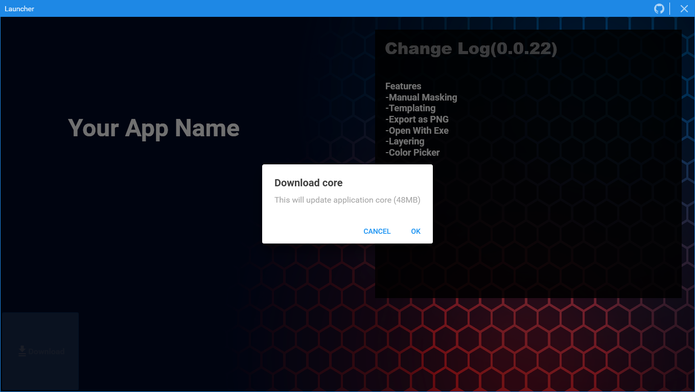
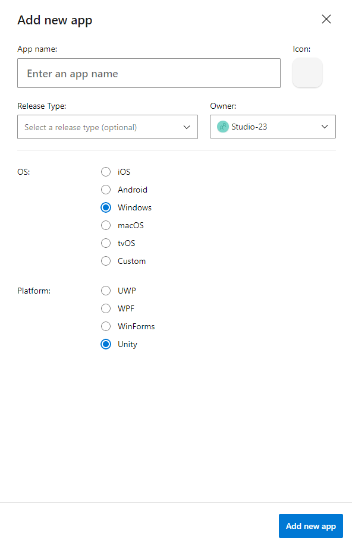

# StandaloneLuncher
A Template Luncher Repository for Deskotop Applications hosted on AppCenter

## Screenshots

#Features
* Realtime Download Progress Bar
* Realtime Extraction Progress Bar
* Changelog From Appcenter
* Easy to configure for your CD Pipeline

# Concept
[Microsoft Appcenter](https://appcenter.ms/) is a service provided by microsoft where you can publish and distribute your applications just like any other store in the market. And they provide api for their service to be used for your needs too. So it's possible to use Appcenter as your version control server where you store your builds and an launcher application to update your application. If you are here you already know what this does.

# Cost?
FREE! Appcenter, Provides unlimited distribution and users. 

# How to use?

## STEP 1 : App Center Configuration
### Create a new app on App Center 

### Copy the app secret

### Upload your build outputs as .zip file

## STEP 2 : Launcher Configuration
### Clone The Repository
### Open the Resource.resx file 

### Change the value of the AppSecret & ApplicationRelativePath at the bottom of the file
**The Releative path will be path to the exe after unzipping the build that was uploaded on appcenter.**

### Build & Publish the project

